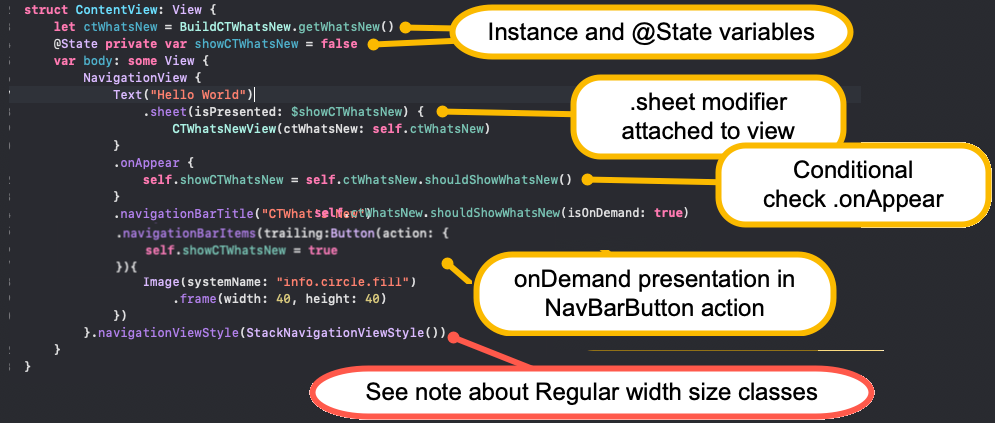

# Whats New Template for SwiftUI
[](https://developer.apple.com/iphone/index.action)[](https://developer.apple.com/swiftui)
A template for displaying new features (and past feature additions) to your app.


### Requirements
- iOS 13.0+
- SwiftUI
- Xcode 11+
### YouTube Video

See overview along with installation and setup instructions at:

*Coming soon.....*

### Installation

1. From within Xcode 11 or later, choose **File > Swift Packages > Add Package Dependency**
2. At the next screen enter https://github.com/StewartLynch/CTWhatsNew_SwiftUI.git when asked to choose a Package repository
3. Choose the latest available version.
4. Add the package to your target.

You now have the dependency installed and are ready to import CTWhatsNew and configure your app.

### Set up

Setting up to present CTWhatsNew.

##### Step 1 - Create your CTWhatsNew Items

As you may wish to present the CTWhatsNew screen from different screen views, you are advised to create a struct that contains a static function returning your instance of CTWhatsNew.

###### a) - Create a new file and name it something like **BuildCTWhatsNew.swift**

###### b) - Replace import Foundation with `import CTWhatsNew` 

```swift
import CTWhatsNew
```

###### c) - Create a struct using the same name as the file

```swift
struct BuildCTWhatsNew {

}
```

c) Within the struct, create a static function and name it **getWhatsNew**() and have it return **CTWhatsNew** 

```swift
struct BuildCTWhatsNew {
    static func getWhatsNew() -> CTWhatsNew {
        
    }
}
```

###### d) - Create an instance of CTWhatsNew
Within the function, create an instance of CTWhatsNew and pass in the **title** and **intro** paragraph for your WhatsNew screen.

```swift
let ctWhatsNew = CTWhatsNew(title: "What's New and Different",
                                    intro: "Changes to this application over time.")
```

###### e) - Create CTWhatsNewItems

The next step is to create a **CTWhatsNewItem** for every update that you wish to display.  To do this you can  use newItem function on your `whatsNew` instance and combine it with the static `CTWhatsNewItem` function.  You could, of course create a number of `CTWhatsNewItems` individually and then use the `whatsNew` function to add them all to your instance later, but in this example, I am showing you the combination of both.

**Note**: The order in which you add the CTWhatsNew item will be reversed on display.  So you can add your most recent changes at the end, and they will be displayed first.

```swift
ctWhatsNew.newItem(CTWhatsNewItem(version: "1.0",
                                    versionTitle: "Initial Release",
                                    description: "Initially released for UIKit and iOS 12"))
ctWhatsNew.newItem(CTWhatsNewItem(version: "1.1",
                                    versionTitle: "Bug fixes",
                                    description: "Fixed typos and updated documentation."))
ctWhatsNew.newItem(CTWhatsNewItem(version: "1.2",
                                    versionTitle: "Enhancement",
                                    description: "New Version rewritten with SwiftUI"))
```

###### e) - Return the instance of CTWhatsnew

After creating all of your CTWhatsNewItems, you can return the completed CTWhatsNew from the function.

The final static function will look something like this:

```swift
struct BuildCTWhatsNew {
  static func getWhatsNew() -> CTWhatsNew {
      let ctWhatsNew = CTWhatsNew(title: "What's New and Different",
                                  intro: "Changes to this application over time.")

      ctWhatsNew.newItem(CTWhatsNewItem(version: "1.0",
                                    versionTitle: "Initial Release",
                                    description: "Initially released for UIKit and iOS 12"))
      ctWhatsNew.newItem(CTWhatsNewItem(version: "1.1",
                                    versionTitle: "Bug fixes",
                                    description: "Fixed typos and updated documentation."))
      ctWhatsNew.newItem(CTWhatsNewItem(version: "1.2",
                                    versionTitle: "Enhancement",
                                    description: "New Version rewritten with SwiftUI"))
        
      return ctWhatsNew
    }
}
```


##### Step 4 - Setup the CTWhatsNew screen

###### a) - Import CTWhatsNew

Go to your  view where you wish to present the CTWhatsNew screen and import CTWhatsNew.

```swift
import CTWhatsNew
```

###### b) - Create an instance of CTWhatsNew

Inside this view, create your CTHelp instance using your static function

```swift
let ctWhatsNew = BuildCTWhatsNew.getWhatsNew()
```

###### c) - Create an `@State` variable 

Next, create an @State variable that will be toggled to display the CTWhatsNew sheet and give it the initial value of `false`.

```swift
@State private var showCTWhatsNew = false
```
###### d) - Enable the Sheet presentation

SwiftUI’s sheets are used to present new views modally over existing ones.  We will make this conditional according to the value of the state variable that we just created.

We can attach the **sheet** modifier to a view within our screen view and within the closure, call the CTWhatsNewView, passing in the instance we created

```swift
.sheet(isPresented: $showCTWhatsNew) {
   CTWhatsNewView(ctWhatsNew: self.ctWhatsNew)
}
```

##### Step 5  - Present the sheet

###### Conditional Presentation

The original intent of CTWhatsNew was to only present the screen once for every new build or version is installed.  CTWhatsNew should check to see if the app is a new version or build number and present it whenever your chosen screen appears.  We should make this check when our view appears and only toggle the ctWhatsNew state variable if necessary.  We do this by calling the `shouldShowWhatsNew`() function of our instance of `CTWhatsNew`.  This returns a Boolean value of either `true` or `false`.

On your parent view, you can use

```swift
.onAppear {
  self.showCTWhatsNew = self.ctWhatsNew.shouldShowWhatsNew()
}
```

###### On Demand presentation

If you wish to display whats new on demand, you can assign it to an action on a button.  If this is the case, add `isOnDemand: true` as the final parameter of the `shouldShowWhatsNew` function.
```swift
self.showCTWhatsNew = self.ctWhatsNew.shouldShowWhatsNew(isOnDemand: true)
```
A sample implementation could look something like this.



#### Regular Width vs Compact Width Size Classes

Your device can have both Regular and Compact size classes.  When the divice is in Regular Width (iPads and most iPhone landscape views) and you are using a NavigationView, the device is shown in SplitView.

This means that when you present that screen, you will see the DetailView instead of the MasterView displayed.  If you have your CTWhatsNew screen presented on a MasterView as my example shows, it will not be presented until you swipe to reveal it.  For this reason, my sample has changed the NavigationViewStyle to a stacked view that does not split the screen.  You will have to determine the best way to present your CTWhatsNew view.

### Optional Parameters

There are three additional optional parameters that you can pass to the `CTWhatsNew.showWhatsNew function that will change the color of the `CTWhatsNew` navigation bar and the colors of the Done button and the navigation bar title.  

**Note:** The default colors support **dark mode** if you are using CTWhatsNew on a device running iOS 13 or later.  If you are going to customize the colors, ensure that you include dark mode supported color sets.

These three colors are:

- **navBarBackgroundColor** - the background color of the navigation bar
- **navBarCloseButtonColor** - the navigation bar done button color
- **navBarTitleColor** - the color for the title

You can add these parameters inside our static `getWhatsNew`() function within the `BuildCTWhatsNew` class 


